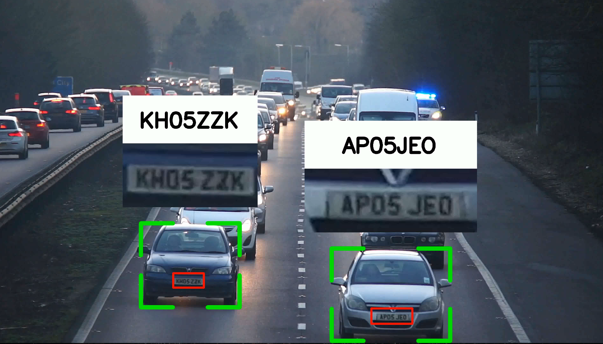

# Vehicle Plate Detection with YOLOv8 and EasyOCR

Detect and recognize vehicle license plates using YOLOv8 and EasyOCR for efficient detection and character extraction.

## Data

The tutorial uses a downloadable video available [here](https://drive.google.com/file/d/12sBfgLICdQEnDSOkVFZiJuUE6d3BeanT/view?usp=sharing).

## Models

- Pretrained YOLOv8 detects vehicles.
- License plate detector was trained with YOLOv8 on [this dataset](https://universe.roboflow.com/roboflow-universe-projects/license-plate-recognition-rxg4e/dataset/4).

## Dependencies

Requires the sort module from [this repository](https://github.com/abewley/sort).

## Result of Testing

